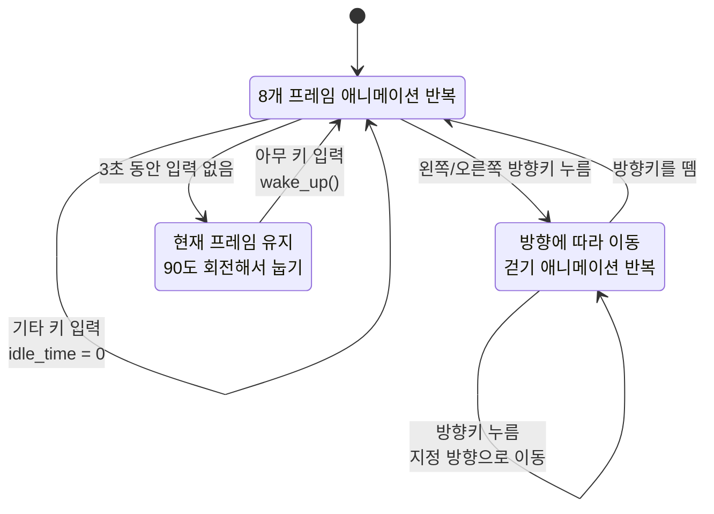

# Character state diagram

```mermaid
stateDiagram-v2
    [*] --> IDLE

    IDLE --> WALK: 왼쪽/오른쪽 방향키 누름
    IDLE --> IDLE: 기타 키 입력<br/>idle_time = 0
    WALK --> WALK: 방향키 누름<br/>지정 방향으로 이동
    WALK --> IDLE: 방향키를 뗌
    IDLE --> SLEEP: 3초 동안 입력 없음
    SLEEP --> IDLE: 아무 키 입력<br/>wake_up()

    IDLE: 8개 프레임 애니메이션 반복
    WALK: 방향에 따라 이동<br/>걷기 애니메이션 반복
    SLEEP: 현재 프레임 유지<br/>90도 회전해서 눕기
```

`ESC` 키는 게임 종료에 사용합니다. 방향키를 누르고 있는 동안 캐릭터가 이동하며,
방향키를 떼면 `IDLE` 상태로 돌아갑니다. `SLEEP` 상태에서는 아무 키나 누르면 깨어납니다.
